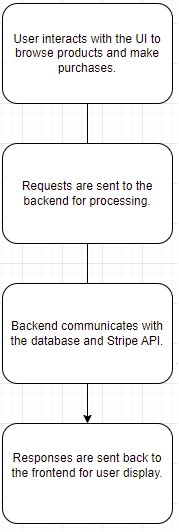
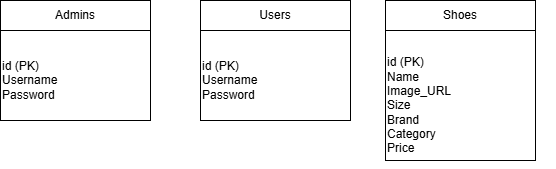
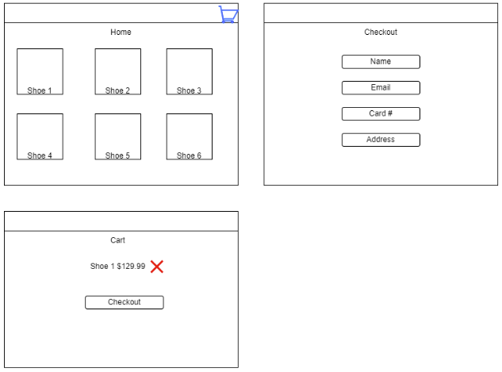

# Overview

## Project Title: Fly Shoes: Online Shoe Store

### Description:
Fly Shoes is a comprehensive online shoe store built to provide users with a seamless shopping experience for browsing, purchasing, and managing shoes. The platform allows customers to:
- Browse shoes by category, size, brand, and price.
- Add items to their shopping cart and securely check out using the Stripe API.
- Log in securely as users, and for admins, manage the shoe inventory, including adding, editing, and deleting products.

The project is designed for scalability and maintainability, utilizing modern web technologies to ensure:
- Responsive design across devices.
- A smooth user interface.
- Secure data handling.

---

### Objectives:
1. **User-Friendly Shopping:** Provide advanced filtering options for customers.
2. **Secure Authentication:** Implement secure login and admin authentication systems.
3. **Payment Integration:** Utilize the Stripe API for smooth checkout and order management.
4. **Admin Management:** Offer a robust interface for product and inventory management.

---

### Impact:
- A fully functional e-commerce platform enabling shoe store owners to manage inventory and process transactions online.
- A secure and responsive shopping experience for users.
- Admin control over the product catalog for easy updates and product additions.

---

### Technologies Used:

#### **Frontend:**
- **React.js:** Dynamic, single-page UI.
- **Bootstrap:** Styling and responsive design.
- **Axios:** HTTP requests to the backend.

#### **Backend:**
- **Node.js & Express:** HTTP requests, routes, and database connections.
- **MySQL:** Relational database for users, products, and transactions.
- **bcrypt:** Secure password hashing.
- **JWT:** Session management (optional for admin).
- **Stripe API:** Payment processing.

#### **Tools & Libraries:**
- **Git & GitHub:** Version control and collaboration.
- **Postman:** API endpoint testing.
- **Heroku/Netlify:** Deployment.
- **Express-session:** Session-based authentication for admins.

---

## Diagrams and Illustrations

### Architecture Diagram


### Data Flow Diagram


### ER Diagram



### Wireframe


---

### Setup Instructions:

**Clone the Repository**:
Front End:
https://github.com/burb3rrydev/fly-shoes
Back End:
https://github.com/burb3rrydev/backend 
Install Backend Dependencies: Navigate to the backend folder and install the required dependencies:

Create a MySQL database and set up the tables according to the provided ER Diagram.
Ensure that the database credentials in db.js are correct.
Setup Frontend: Navigate to the fly-shoes folder and install the frontend dependencies:

Update the backend to use your Stripe API keys.
Adjust any environment variables (e.g., database credentials) as needed.
Run the Project Locally:

For the backend, run:
node server.js
For the frontend, run:
npm runt start
This will start the backend and frontend servers, and you can access the website by navigating to http://localhost:3000.

Deploy the Project:
Deploy the backend to Heroku or another cloud platform.
Deploy the frontend to Netlify or any other hosting provider of your choice.

Accessing the Project:
The application can be accessed through the URL where the frontend is hosted https://flyshoes-frontend-d4a16ae44cdf.herokuapp.com/login
Admins can access the admin dashboard after logging in with the admin credentials, typically stored in the backend's database.
---

## Code Snippets

### Admin Authentication (Login):
```javascript
const express = require('express');
const router = express.Router();
const db = require('../config/db');

// Admin Login
router.post('/admin/login', (req, res) => {
    const { username, password } = req.body;

    const query = 'SELECT * FROM admins WHERE username = ?';
    db.query(query, [username], (err, results) => {
        if (err) return res.status(500).send({ success: false });

        if (results.length > 0 && results[0].password === password) {
            return res.status(200).send({ success: true });
        }
        return res.status(401).send({ success: false });
    });
});

module.exports = router;

### User Authentication - Login Route

This route handles user login by verifying the username and password against the database.

#### Endpoint:
`POST /login`

#### Request Body:
```json
{
  "username": "user123",
  "password": "securepassword123"
}

# Shoe Management Routes

## Get All Shoes
```javascript
// GET all shoes
router.get('/shoes', (req, res) => {
    const query = 'SELECT * FROM shoes';
    db.query(query, (err, results) => {
        if (err) return res.status(500).json({ message: 'Failed to retrieve shoes' });
        res.status(200).json(results);
    });
});

### Add A Shoe
```javascript
// Add a new shoe (Admin only)
router.post('/admin/shoes', (req, res) => {
    const { name, image_url, size, brand, category, price } = req.body;
    const query = 'INSERT INTO shoes (name, image_url, size, brand, category, price) VALUES (?, ?, ?, ?, ?, ?)';
    db.query(query, [name, image_url, size, brand, category, price], (err, results) => {
        if (err) return res.status(500).json({ message: 'Failed to add shoe' });
        res.status(201).json({ message: 'Shoe added successfully' });
    });
});

### Update A Shoe
```javascript
// Update Shoe
router.put('/admin/shoes/:id', (req, res) => {
    const { id } = req.params;
    const { name, image_url, size, brand, category, price } = req.body;
    const query = 'UPDATE shoes SET name = ?, image_url = ?, size = ?, brand = ?, category = ?, price = ? WHERE id = ?';
    db.query(query, [name, image_url, size, brand, category, price, id], (err, results) => {
        if (err) return res.status(500).json({ message: 'Failed to update shoe' });
        if (results.affectedRows > 0) {
            res.status(200).json({ message: 'Shoe updated successfully' });
        } else {
            res.status(404).json({ message: 'Shoe not found' });
        }
    });
});

### Delete A Shoe
```javascript
// Delete Shoe
router.delete('/admin/shoes/:id', (req, res) => {
    const { id } = req.params;
    const query = 'DELETE FROM shoes WHERE id = ?';
    db.query(query, [id], (err, results) => {
        if (err) return res.status(500).json({ message: 'Failed to delete shoe' });
        res.status(200).json({ message: 'Shoe deleted successfully' });
    });
});

---
