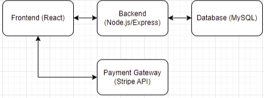

# Overview

## Project Title: Fly Shoes: Online Shoe Store

### Description:
Fly Shoes is a comprehensive online shoe store built to provide users with a seamless shopping experience for browsing, purchasing, and managing shoes. The platform allows customers to:
- Browse shoes by category, size, brand, and price.
- Add items to their shopping cart and securely check out using the Stripe API.
- Log in securely as users, and for admins, manage the shoe inventory, including adding, editing, and deleting products.

The project is designed for scalability and maintainability, utilizing modern web technologies to ensure:
- Responsive design across devices.
- A smooth user interface.
- Secure data handling.

---

### Objectives:
1. **User-Friendly Shopping:** Provide advanced filtering options for customers.
2. **Secure Authentication:** Implement secure login and admin authentication systems.
3. **Payment Integration:** Utilize the Stripe API for smooth checkout and order management.
4. **Admin Management:** Offer a robust interface for product and inventory management.

---

### Impact:
- A fully functional e-commerce platform enabling shoe store owners to manage inventory and process transactions online.
- A secure and responsive shopping experience for users.
- Admin control over the product catalog for easy updates and product additions.

---

### Technologies Used:

#### **Frontend:**
- **React.js:** Dynamic, single-page UI.
- **Bootstrap:** Styling and responsive design.
- **Axios:** HTTP requests to the backend.

#### **Backend:**
- **Node.js & Express:** HTTP requests, routes, and database connections.
- **MySQL:** Relational database for users, products, and transactions.
- **bcrypt:** Secure password hashing.
- **JWT:** Session management (optional for admin).
- **Stripe API:** Payment processing.

#### **Tools & Libraries:**
- **Git & GitHub:** Version control and collaboration.
- **Postman:** API endpoint testing.
- **Heroku/Netlify:** Deployment.
- **Express-session:** Session-based authentication for admins.

---

## Diagrams and Illustrations

### Architecture Diagram


### Data Flow Diagram


### ER Diagram


### Wireframe


---

## Code Snippets

### Admin Authentication (Login):
```javascript
const express = require('express');
const router = express.Router();
const db = require('../config/db');

// Admin Login
router.post('/admin/login', (req, res) => {
    const { username, password } = req.body;

    const query = 'SELECT * FROM admins WHERE username = ?';
    db.query(query, [username], (err, results) => {
        if (err) return res.status(500).send({ success: false });

        if (results.length > 0 && results[0].password === password) {
            return res.status(200).send({ success: true });
        }
        return res.status(401).send({ success: false });
    });
});

module.exports = router;
